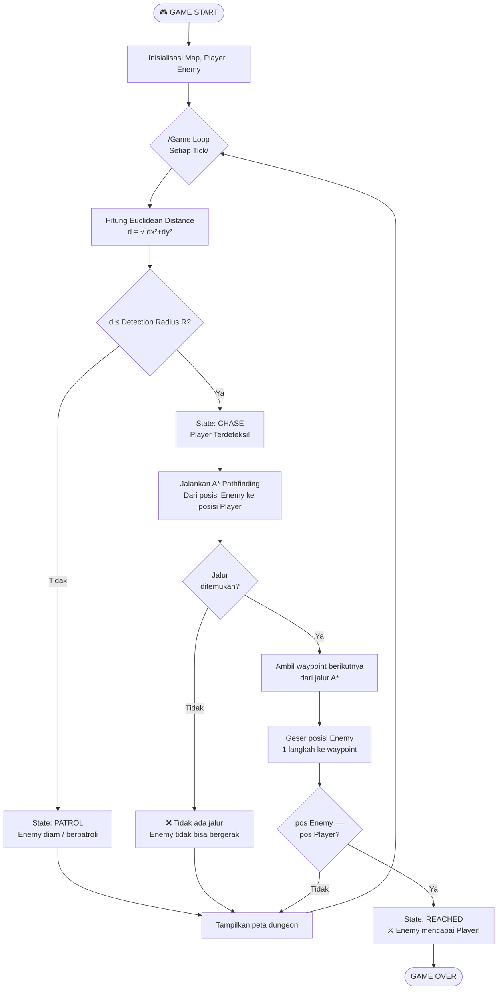

# Tugas 1 - Game Development: Enemy AI in a Dungeon

> **Skenario**: Player bergerak di dalam sebuah dungeon. Enemy harus mendeteksi player, menentukan apakah player berada dalam jangkauan, mencari jalur menuju player, kemudian bergerak menuju player.

---

## Jawaban 1: Identifikasi Algoritma

Terdapat **empat tahapan utama** dalam siklus AI musuh, masing-masing menggunakan algoritma yang sesuai:

### Tabel Ringkasan Algoritma

| No. | Tahapan | Algoritma | Alasan Pemilihan |
|:---:|:--------|:----------|:-----------------|
| 1 | Siklus Keputusan AI | **Finite State Machine (FSM)** | Mengatur transisi kondisi enemy secara terstruktur dan efisien |
| 2 | Deteksi Jangkauan | **Euclidean Distance** | Mengukur jarak garis lurus antar dua titik di grid 2D |
| 3 | Pencarian Jalur | **A\* (A-Star) Pathfinding** | Menemukan jalur terpendek di peta dengan penghalang/dinding |
| 4 | Pergerakan | **Waypoint Traversal** | Bergerak satu langkah per tick mengikuti rute yang dihasilkan A\* |

---

### 1.1 Finite State Machine (FSM)

**FSM** adalah model komputasi yang merepresentasikan logika pengambilan keputusan sebagai sekumpulan *state* (kondisi) dan *transition* (aturan perpindahan antar kondisi).

**State enemy dalam dungeon:**

```
┌─────────┐   dist ≤ R   ┌────────┐   pos == player   ┌─────────┐
│  PATROL │ ─────────────► CHASE  │ ──────────────────► REACHED │
│  (idle) │              │(kejar) │                   │(selesai)│
└─────────┘ ◄────────────└────────┘                   └─────────┘
              dist > R
```

- **PATROL**: Enemy tidak mendeteksi player. Bisa berpatroli atau diam.
- **CHASE**: Player berada dalam radius deteksi. Enemy menjalankan A\* dan bergerak mendekati player.
- **REACHED**: Enemy berhasil mencapai posisi player.

---

### 1.2 Euclidean Distance (Deteksi Jangkauan)

Digunakan untuk mengukur **jarak lurus** antara posisi enemy $(x_e, y_e)$ dan posisi player $(x_p, y_p)$.

$$d = \sqrt{(x_p - x_e)^2 + (y_p - y_e)^2}$$

**Logika deteksi:**
```
Jika d ≤ R (Detection Radius)  →  Player terdeteksi  →  State: CHASE
Jika d > R                     →  Tidak terdeteksi   →  State: PATROL
```

Euclidean Distance dipilih karena merepresentasikan jarak fisik yang realistis di dunia 2D, berbeda dengan Manhattan Distance yang hanya menghitung pergerakan horizontal+vertikal.

---

### 1.3 A\* (A-Star) Pathfinding Algorithm

**A\*** adalah algoritma pencarian jalur terpendek yang paling umum digunakan dalam game development. A\* menggabungkan kelebihan **Dijkstra** (jaminan jalur terpendek) dan **Greedy Best-First Search** (kecepatan dengan heuristik).

**Fungsi evaluasi A\*:**

$$f(n) = g(n) + h(n)$$

Keterangan:
- $f(n)$ = **Total cost** node $n$ (prioritas dalam antrian)
- $g(n)$ = **Actual cost** dari titik start ke node $n$
- $h(n)$ = **Heuristic cost** — estimasi jarak dari node $n$ ke goal

**Fungsi heuristik yang digunakan (Manhattan Distance):**

$$h(n) = |x_{goal} - x_n| + |y_{goal} - y_n|$$

Manhattan Distance dipilih sebagai heuristik karena pergerakan di dungeon grid hanya boleh 4 arah (atas, bawah, kiri, kanan), sehingga Manhattan Distance adalah *admissible heuristic* yang tidak pernah melebih-lebihkan biaya sebenarnya.

**Langkah kerja algoritma A\*:**
1. Masukkan node start ke **Open List** (priority queue, diurutkan berdasarkan $f$).
2. Ambil node dengan nilai $f$ terkecil dari Open List.
3. Jika node tersebut adalah **goal** → rekonstruksi jalur → selesai.
4. Pindahkan node ke **Closed Set** (sudah dievaluasi).
5. Eksplorasi semua tetangga node yang bisa dilewati:
   - Hitung $g_{baru} = g_{current} + 1$
   - Hitung $h = h(tetangga, goal)$
   - Hitung $f = g_{baru} + h$
   - Jika jalur ini lebih baik dari sebelumnya → update dan masukkan ke Open List.
6. Ulangi dari langkah 2 hingga Open List kosong (tidak ada jalur) atau goal ditemukan.

**Kompleksitas:**
- Waktu: $O(b^d)$ di worst case, sangat efisien dengan heuristik yang baik
- Ruang: $O(b^d)$ untuk menyimpan Open/Closed List

---

### 1.4 Waypoint Traversal (Pergerakan)

Setelah A\* menghasilkan daftar koordinat (path), enemy bergerak dengan mengambil koordinat berikutnya dari list tersebut satu per satu setiap game tick. Ini disebut **waypoint traversal**.

```
Path A* = [(1,11), (2,11), (3,11), ..., (17,1)]
         ↑                                    ↑
       Start (enemy)                        Goal (player)

Tick 1: enemy pindah ke (2,11)
Tick 2: enemy pindah ke (3,11)
... dst.
```

---

## Jawaban 2: Flowchart Algoritma



---

## Jawaban 3: Code Snippet (C++)

File kode lengkap tersedia di: [`main.cpp`](./main.cpp)

Berikut cuplikan bagian-bagian penting dari implementasi:

### Snippet 1: Euclidean Distance
```cpp
// Menghitung jarak garis lurus antara dua titik
// Formula: sqrt((x2-x1)^2 + (y2-y1)^2)
double euclideanDistance(const Point& a, const Point& b) {
    double dx = static_cast<double>(b.x - a.x);
    double dy = static_cast<double>(b.y - a.y);
    return std::sqrt(dx * dx + dy * dy);
}
```

### Snippet 2: Fungsi Heuristik A\* (Manhattan Distance)
```cpp
// Heuristik admissible untuk grid 4-arah
// Formula: |x2-x1| + |y2-y1|
double heuristic(const Point& a, const Point& b) {
    return std::abs(b.x - a.x) + std::abs(b.y - a.y);
}
```

### Snippet 3: Inti Algoritma A\*
```cpp
// Loop utama A*
while (!openList.empty()) {
    Node current = openList.top(); // Ambil node dengan f terkecil
    openList.pop();

    if (current.pos == goal) {
        // Rekonstruksi jalur dari goal ke start, lalu balik
        // ...
        return path;
    }

    // Eksplorasi 4 tetangga
    for (int i = 0; i < 4; i++) {
        int nx = current.pos.x + dx[i];
        int ny = current.pos.y + dy[i];

        if (!map.isWalkable(nx, ny)) continue;

        double newG = gCost[current.pos.y][current.pos.x] + 1.0;
        double h = heuristic({nx, ny}, goal);
        double f = newG + h;   // f(n) = g(n) + h(n)

        if (newG < gCost[ny][nx]) {
            gCost[ny][nx] = newG;
            parent[ny][nx] = current.pos;
            openList.push({{nx, ny}, newG, h, f, current.pos});
        }
    }
}
```

### Snippet 4: FSM Enemy Update
```cpp
void update(const DungeonMap& map, const Point& playerPos) {
    double dist = euclideanDistance(pos, playerPos);

    // FSM Transition
    if (dist <= DETECTION_RADIUS) {
        state = EnemyState::CHASE;
        if (currentPath.empty()) {
            currentPath = aStarPathfind(map, pos, playerPos); // Hitung jalur
        }
    } else {
        state = EnemyState::PATROL;
        currentPath.clear();
    }

    // FSM Action
    if (state == EnemyState::CHASE) {
        chase(map, playerPos); // Bergerak 1 langkah
    }
}
```

---

## Cara Compile & Run

### Menggunakan g++ (MinGW / Linux / Mac)
```bash
g++ -std=c++17 -o dungeon main.cpp
./dungeon        # Linux/Mac
dungeon.exe      # Windows
```

### Menggunakan Online Compiler
Kode ini kompatibel dengan:
- [replit.com](https://replit.com) — buat proyek C++, paste `main.cpp`
- [onlinegdb.com](https://www.onlinegdb.com/online_c++_compiler)
- [godbolt.org](https://godbolt.org)

> **Catatan**: Hapus atau comment baris `std::this_thread::sleep_for(...)` jika menggunakan online compiler yang tidak mendukung `<thread>`.

---

## Struktur File

```
Tugas 1/
├── Flowchart/
│   └── Flowchart.png  ← Gambar flowchart algoritma
├── snippet.cpp        ← Program utama C++
└── README.md          ← Dokumen jawaban tugas ini
```

---

## Referensi

- Hart, P. E., Nilsson, N. J., & Raphael, B. (1968). *A Formal Basis for the Heuristic Determination of Minimum Cost Paths.* IEEE Transactions on Systems Science and Cybernetics.
- Millington, I., & Funge, J. (2009). *Artificial Intelligence for Games (2nd ed.).* Morgan Kaufmann.
- RedBlobGames — A\* Pathfinding: https://www.redblobgames.com/pathfinding/a-star/introduction.html
